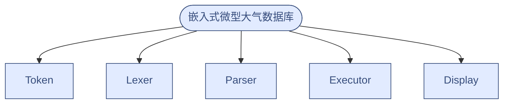
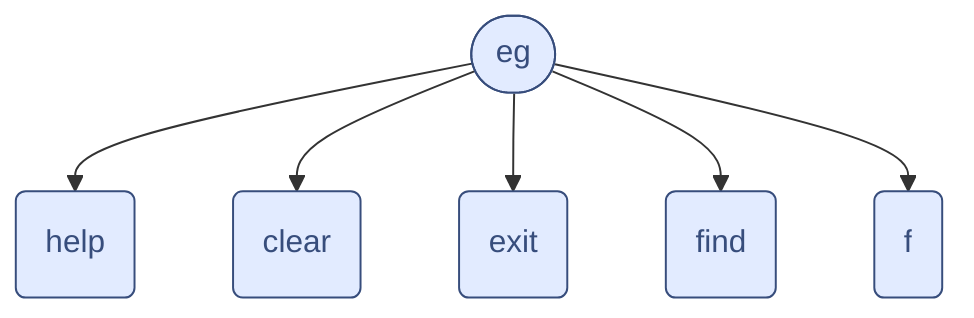

数据库整体图

数据库TOken图
```mermaid
flowchart TB
    A(["Token"]) --> AE("eg") & B("help") & E("clear") & F("exit") & G("story") & H("author") & I("subject") & J("list") & K("ls") & AB("page") & AC("p") & D("find") & AD("f") & AE("back) 

     A:::startend
     A:::Sky
     AE:::process
     AE:::Sky
     B:::process
     B:::Sky
     E:::process
     E:::Sky
     F:::process
     F:::Sky
     G:::process
     G:::Sky
     H:::process
     H:::Sky
     I:::process
     I:::Sky
     J:::process
     J:::Sky
     K:::process
     K:::Sky
     AB:::process
     AB:::Sky
     AC:::process
     AC:::Sky
     D:::process
     D:::Sky
     AD:::process
     AD:::Sky
    classDef startend fill:#F5EBFF,stroke:#BE8FED,stroke-width:2px
    classDef process fill:#E5F6FF,stroke:#73A6FF,stroke-width:2px
    classDef Sky stroke-width:1px, stroke-dasharray:none, stroke:#374D7C, fill:#E2EBFF, color:#374D7C


```
eg结构图
